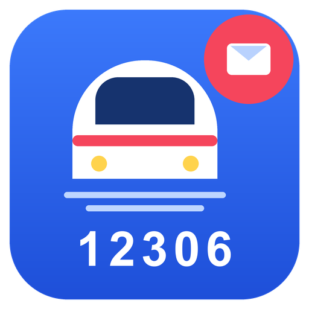

#  12306 邮件分析

从邮箱读取 12306 购票/退票/改签通知邮件，自动生成一份 HTML 出行统计报告，并发送到你的邮箱。

- 纯 Python 标准库实现，零第三方依赖
- 支持 ZCode、Claude Code、Codex、Trae 等主流 Agent
- 统计口径严谨：真实乘坐、实际净支出、退改扣费分别核算

---

## 功能

输入邮箱中的 12306 邮件，输出一份完整的出行画像：

- **总体概览**：出行次数、消费总额、退改扣费、平均票价
- **年度统计**：逐年出行次数与消费
- **城市路线**：出发/到达城市、热门路线 TOP 10
- **常坐列车**：乘坐频次最高的车次
- **座位偏好**：各座位类型的乘坐次数与平均票价
- **出发时间**：常出行的时段分布
- **乘客统计**：每位乘车人的出行次数与消费

> 📄 **效果预览**：[查看示例报告](https://htmlpreview.github.io/?https://github.com/AndSync/mail-analysis-12306/blob/main/docs/sample-report.html)

## 使用方式

### 在 ZCode 中（推荐，支持可视化配置）

1. **插件市场 → 添加 → 添加插件市场**，粘贴：
   ```
   https://github.com/AndSync/mail-analysis-12306
   ```
   （国内访问 GitHub 慢可用 Gitee 镜像：`https://gitee.com/andsyncpro/mail-analysis-12306`）
2. 在 **个人 → 12306-mail-tools** 找到「12306邮件分析」，点击**安装**。
3. 到 **设置 → 插件管理 → 12306邮件分析 → 详情 → 高级设置**，填写邮箱信息。
4. **重启 ZCode**，然后说：
   > 分析我的 12306 出行记录，把统计报告发到我的邮箱

### 在 Claude Code 中

```bash
/plugin marketplace add AndSync/mail-analysis-12306
/plugin install mail-analysis-12306@12306-mail-tools
```

邮箱信息通过配置文件提供（见下文「配置」）。

### 在 Codex 中

在 `~/.codex/config.toml` 注册 MCP 服务器：

```toml
[mcp_servers.mail12306]
command = "python"
args = ["/path/to/mail-analysis-12306/src/mcp_server.py"]
env = { MAIL12306_SENDER_EMAIL = "你的邮箱", MAIL12306_SENDER_PASSWORD = "授权码", MAIL12306_RECIPIENT_EMAIL = "收件人@example.com" }
```

### 在 Trae 等其他 MCP Agent 中

在 MCP 设置里添加 stdio 服务器：command 填 `python`，args 填 `src/mcp_server.py` 的绝对路径，env 里填 `MAIL12306_SENDER_EMAIL` / `MAIL12306_SENDER_PASSWORD` / `MAIL12306_RECIPIENT_EMAIL`。

### 命令行

```bash
python src/main.py --config /path/to/config.json
```

---

## 配置

需要三项邮箱信息：

| 项目 | 说明 |
|------|------|
| 邮箱地址 | 读取 12306 邮件的账号，同时作为发件账号 |
| IMAP/SMTP 授权码 | 不是登录密码。QQ 邮箱：网页版 → 设置 → 账户 → 开启 POP3/IMAP/SMTP 服务 → 生成授权码 |
| 报告收件人 | 单个邮箱地址 |

**服务器地址**（QQ 邮箱已实测）：

| 邮箱 | IMAP 服务器 | SMTP 服务器 |
|------|-------------|-------------|
| QQ（已测试） | imap.qq.com | smtp.qq.com |
| 163 | imap.163.com | smtp.163.com |
| Gmail | imap.gmail.com | smtp.gmail.com |
| Outlook | outlook.office365.com | smtp.office365.com |

端口通常为 IMAP 993、SMTP 465（SSL）。

配置文件示例（命令行 / Claude Code / Codex 等用）：

```json
{
  "email": {
    "sender_email": "你的邮箱",
    "sender_password": "你的IMAP/SMTP授权码",
    "recipient_email": ["收件人@example.com"]
  },
  "imap_server": "imap.qq.com",
  "imap_port": 993,
  "smtp_server": "smtp.qq.com",
  "smtp_port": 465,
  "analysis": { "mailbox_name": "网上购票", "max_emails": 10000 }
}
```

> 12306 邮件通常在「网上购票」文件夹（QQ 邮箱）。设置 `mailbox_name` 可大幅加快读取；留空则扫描全邮箱。

---

## 统计口径

| 指标 | 含义 |
|------|------|
| 出行次数 | 退改抵消后的真实乘坐记录（退票、改签作废的旧票、改签后再退的都不算） |
| 消费总额 | 实际净支出 = 购票实付 + 改签补差 − 改签退差 − 退票退款 |
| 退改扣费 | 退票手续费 + 改签手续费（因时间原因被扣的费用） |
| 平均票价 | 有效行程票价均值 |

其他规则：城市统计排除同城行程（如 北京北→八达岭长城），车站名自动归并到主城市；列表最多 10 条，同次数按最近乘坐排前。

---

## 实现方案

- **数据流**：IMAP 读邮件 → 解析购票/退票/改签 → 统计分析 → 生成 HTML → SMTP 发送
- **邮件解析**：兼容 12306 新旧两种邮件格式，支持多人订单自动拆分、退票/改签类型识别
- **城市归并**：内置全国主要城市的站点别名映射（`config/config_cities.json`），如 武昌/汉口→武汉
- **MCP 服务器**：标准 stdio JSON-RPC，提供配置管理、后台分析、状态查询工具；未配置邮箱时强制拒绝运行

## 隐私

- 邮件只读取本机邮箱（IMAP），报告只发送到你填写的收件人，数据不经过第三方。
- 授权码以明文保存在本机。请勿把真实授权码提交到代码仓库。

## 技术细节

- 纯 Python 标准库（imaplib / smtplib / email / html.parser / re / json），零第三方依赖
- 详见 [docs/TECHNICAL.md](docs/TECHNICAL.md)

## License

MIT
